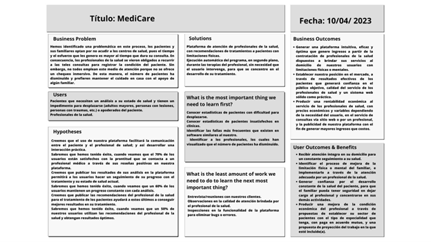
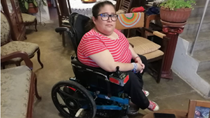

# INTRODUCTION 
## 1.1.	Startup Profile
##### A continuación, procederemos a informar sobre a lo que se dedica nuestra empresa “MEDICARE”.

### 1.1.1.	 Descripción de la Startup
##### En la actualidad existe un número exorbitante de personas que necesitan ayuda para poder mantener o mejorar su calidad de vida. Específicamente en Lima, Perú. Se ha identificado que realizar un buen cuidado de personas discapacitadas, vulnerables o con una enfermedad grave, es una labor demasiado difícil. Asimismo, los familiares de estos individuos son directamente afectados por las condiciones en las que se encuentran, pues su cuidado requiere demasiado tiempo y, del mismo modo, un gran esfuerzo físico. Además, después de la aparición del COVID-19 en el país, las personas se han acostumbrado a tener una solución a sus problemas de forma remota sin tener que salir de casa. 
##### Por esta razón, hemos decidido crear un startup llamado “MEDICARE”. Somos una empresa emergente con grandes posibilidades de crecimiento. A una primera instancia, no contamos con una gran cantidad de clientes, pero con el transcurso del tiempo estamos enfocados en crecer en el mercado aplicando el potencial de las tecnologías.
##### Nuestra misión actual es encontrar la forma más viable e innovadora de ayudar a las personas que tienen familiares que padecen de enfermedades graves o limitaciones físicas o de otra índole, apoyándolos en su cuidado diario y facilitando esta tarea. Donde crearemos un software que ofrezca la ayuda de distintos enfermeros o doctores confiables para que realicen una visita médica a la casa del cliente. Al mismo tiempo, nuestra visión es convertirnos en un startup líder en el desarrollo de soluciones con la ventaja competitiva de emplear la tecnología para que ayuden a resolver distintas problemáticas médicas en el Perú.

## 1.2.	Solution Profile
##### En este punto del informe, pasaremos a la explicación detallada de nuestro producto software, tanto su factor innovador y la forma en la cual será monetizada. 
**Product Name**
##### Se decidió llamar a nuestro producto “MEDICARE”, ya que, en el lenguaje inglés, ‘Medi’ es una abreviación de médico y ‘Care’, cuidado; por lo que el nombre completo se traduce como “Atención Medica”. Del mismo modo, se eligió este idioma porque, además de generar más atractivo hacia el público, es el idioma más hablado del mundo, lo cual vuelve más comercial a nuestra aplicación.
**Product Description**
##### Este software es innovador ya que ofreceremos la posibilidad de contratar profesionales de salud que se encarguen de cuidar a personas con limitaciones físicas o de otra índole. En esta aplicación, los contratantes podrán visualizar una larga lista de personal de salud altamente calificado. Asimismo, se presentarán las referencias de pacientes o contratantes anteriores junto con la tarifa estándar de consulta y diferentes paquetes que se adecuen al área médica correspondiente a cada profesional. Con el registro del usuario y la elección del médico o enfermero se podrá dar seguimiento continuo al beneficiario, el cual será similar a un historial médico virtual que se adecue a la frecuencia de visita elegida por el contratante. 
**Monetization**
##### Nuestro servicio podrá ser adquirido de manera gratuita. Sin embargo, los profesionales de la salud registrados tendrán una retención entre el 5% y 10% de sus ingresos mensuales por conceptos de captación de pacientes a través de nuestra plataforma. 
### 1.2.1.	Antecedentes y problemática del producto 
**Descripción de la problemática**
##### Este software se enfoca en el sector de salud, ya que se ha evidenciado que hay leve incremento en pacientes insatisfechos con las citas brindadas por las clínicas.  Es por esta razón que “MediCare” busca cubrir las necesidades de la comunicación, seguridad y eficacia a la mayor cantidad de personas posibles en su domicilio.
**Objetivos**
##### Este software tiene el principal objetivo de cubrir las necesidades básicas de atención médica a domicilio de las personas con limitaciones físicas o mentales que no puedan acudir a un centro médico. Por otro lado, lograr ser una empresa reconocida y contar con un producto sostenible económicamente es un objetivo general de MediCare. 
**Restricciones**
##### Una principal restricción que delimita el alcance del proyecto es que el equipo desarrollador es nuevo en estas tendencias o técnicas a aplicar para lanzar nuestra aplicación. Por ello, es que puede ser una restricción de alcanzar el mejor escenario. Sin embargo, el equipo pondrá de su parte para lograr alcanzar el nivel deseable de cada entregable. 

**Antecedentes**
##### Como se mencionó anteriormente, nuestro producto software “MediCare.” tiene la capacidad de contratar profesionales de salud que se encarguen de cuidar a personas con limitaciones físicas o de otra índole y además dar seguimiento continuo al beneficiario, el cual será similar a un historial médico virtual que se adecue a la frecuencia de visita elegida por el contratante. Es por ello por lo que, teniendo en cuenta el funcionamiento de nuestro producto, realizamos la búsqueda de posibles competidores, obteniendo como resultado dos productos software:
*	MedicApp:
    *	##### Es una aplicación en la cual una persona puede agendar por medio de llamada o WhatsApp, una cita a domicilio de Médico o Enfermero. Cuenta con un horario limitado de lunes a sábados de 8 am a 8 pm. Asimismo, ofrece tele consultas y pruebas de descarte de la COVID-19. Cuenta con una alianza con una institución dedicada al transporte de pacientes con situaciones graves, ambulancias.Sin embargo, la principal diferencia que separa a MediCare.  de MedicApp es que, en nuestra aplicación, es posible contactar con un doctor específico que le brinde confianza al usuario. Por otro lado, en la aplicación MedicApp, los doctores son brindados según la disponibilidad que tiene la aplicación y el usuario no interactúa de manera constante en el proceso de selección. Asimismo, no mantienen, en la aplicación, un registro virtual de todas las citas que ha tenido el paciente ni de las recomendaciones brindadas. 
*	MediQuo:
    * ##### Es una aplicación donde se puede realizar consultas, gestionar citas mediante el chat que está disponible en su web, además que tiene seguimiento registrado en la aplicación móvil. Sin embargo, una de las diferencias que existe entre MediCare  y MediQuo es que, mientras en MediQuo solo se hacen consultas digitales, en MediCare se tiene contacto directo. Además, al contrario que la aplicación MediQuo, MediCare puede generar un historial médico virtual que varía dependiendo de cada contratante.

**Herramienta 5W y 2H**
* What - ¿Cuál es el problema?
    * ##### El problema identificado es la cantidad exorbitante de personas de edad avanzada y/o que sufren de limitaciones físicas o de otra índole. Es decir, que no pueden mantener un cuidado autónomo y requieren de la asistencia de otro individuo para mantener una salud estable.
* When - ¿Cuándo sucede el problema?
    * ##### Cuando es necesaria la supervisión o tratamiento de un médico para individuos con capacidades limitadas, o simplemente cuando se requiere de personas extras para el cuidado de los pacientes y los familiares que carecen de tiempo o son incapaces de atenderlos sin ayuda.

* Where - ¿Dónde surge el problema?
    * ##### El problema surge en los distintos hogares de la capital, pues día a día las personas deben salir a ejercer sus obligaciones laborales y no cuentan con el tiempo suficiente y la ayuda necesaria para mantener la calidad de vida y cuidado de sus familiares con limitaciones físicas o mentales.
* Who - ¿Quiénes son afectados por el problema?
    * ##### Los principales afectados son las personas de la tercera edad y aquellas que presentan enfermedades que precisan de atención inmediata.
* Why - ¿Cuál es la causa del problema?
    * ##### La causa del problema es principalmente la falta de tiempo por parte de los familiares de personas de edad avanzada y/o con discapacidades físicas o de otra índole para cuidarlos y mantenerlos con un estado de salud estable.
* How - ¿Cómo se llevan a cabo los hechos?
    * ##### Cuando una familia cuenta con un integrante que requiere de supervisión constante, los demás miembros tienen que brindar gran parte de su tiempo para su cuidado. Además, el encontrar personas de confianza y que estén capacitadas para la atención del individuo es complicado, lo cual solo genera que la situación sea más difícil, y esto empeora si el paciente requiere de uso de medicina. Por eso, es necesaria una forma fácil y sencilla de contactar con la ayuda necesaria para la atención de los familiares vulnerables.
* How much - ¿Cuál es la magnitud del problema?
    * ##### Según el INEI (2018), se recopiló a nivel de Lima metropolitana que el 84,9% de los adultos mayores femeninas y 67,3% de los adultos mayores masculinos presentan enfermedades crónicas como artritis, hipertensión, diabetes, etc. De esta manera, se identifica que existe un gran porcentaje de adultos mayores con necesidad de un cuidado médico. Cabe resaltar que en el presente informe del INEI (2018), se menciona que esta población mayor de 60 años con limitaciones o discapacidades físicas o mentales, no asistieron a un establecimiento para atenderse (72,7%) y un poco más de la cuarta parte (25,6%) no acudió a un establecimiento de salud porque le queda lejos, no le genera confianza o se demoran en la atención. Así, se identifica que hay una necesidad de atención médica a domicilio, pues es el lugar donde estas personas se sienten más cómodos y seguros.

### 1.2.2.	Lean UX Process 
#### 1.2.2.1.	Lean UX Problem Statement
**Problem Statement** 
##### Con respecto a la atención médica en centros médicos públicos y privados, se evidencia el incremento de insatisfacción por el servicio brindado para los pacientes, ya sea por la mala atención, complicaciones para generar citas, incomodidad en las instalaciones y/o complicaciones de movilidad para desplazar al paciente a estos centros médicos.
##### Hemos identificado una problemática en este proceso, los pacientes y sus familiares optan por no acudir a los centros de salud, pues el tiempo y el esfuerzo que les genera es mayor al tiempo que dura su consulta. En consecuencia, los profesionales de la salud se vieron obligados a recurrir a las teles consultas para registrar la condición del paciente. Sin embargo, no todos emplean este medio de atención porque no se ofrece un chequeo inmersivo. De esta manera, el número de pacientes ha disminuido y personas mayores con alguna discapacidad prefieren mantener el cuidado en casa con el apoyo de algún familiar.
##### ¿Cómo podemos hacer que los pacientes reciban una atención íntegra, eficaz y beneficiosa para su salud en un ambiente en el que se sienta cómodo, como su domicilio sin la necesidad de realizar un gran traslado que tome demasiado tiempo y así los médicos tengan una mayor cantidad de pacientes y no vean perjudicados sus ingresos económicos?

#### 1.2.2.2.	Lean UX Assumptions

**Business Outcomes**
* ##### Generar una plataforma intuitiva, eficaz y óptima que genere ingresos a partir de la contratación de profesionales de la salud dispuestos a brindar sus servicios al domicilio de nuestros usuarios con limitaciones físicas o mentales.
* ##### Establecer nuestra posición en el mercado, a través de resultados efectivos de los pacientes que generará confianza en el público objetivo, calidad del servicio de los profesionales de salud y un sistema web sólido como práctico.
* ##### Producir una rentabilidad económica al servicio de los profesionales de salud, con precios económicos y variables dependiendo de la necesidad del usuario, en el servicio de consultas vía sitio web o por un profesional, y la publicidad de nuestra plataforma con el fin de generar mayores ingresos que costos.
* ##### Sentar una tasa de retención por determinado periodo, para verificar si nuestros usuarios siguen utilizando nuestro servicio, con campañas de marketing, servicio que cumple sus necesidades con funciones de la plataforma, y si no se cumple, identificar cuáles serían las razones del abandono del servicio.
**Users** 
* ##### Público adulto mayor o personas con discapacidades físicas o mentales y sus familiares.
* ##### Profesionales de la Salud.
**User Outcomes** 
* ##### Identificar el proceso de mejora de la limitación física o mental del familiar, e implementarlo a través de la atención adecuada por un profesional de la salud.
* ##### Generar confianza por el desarrollo constante de la salud del paciente, para que el familiar pueda tener seguridad en dejar cargo al profesional y concentrarse en sus demás actividades.
* ##### Solventar las dudas del familiar acerca de cómo se puede dar una mejora de la salud del paciente a través de las consultas médicas que dispone la plataforma.
* ##### Producir una mejora de la condición económica del profesional a través de propuestas de establecer su sector de pacientes con el tipo de especialidad que tenga, con paga en acuerdo mutuo, y una propuesta de proyección del trabajo en la que esté incluido(a).

**Features**
* ##### Información del paciente y registro de su condición actual para que el profesional de la salud pueda identificar el mejor tratamiento.
* ##### Sección para visualizar a los profesionales de la salud con sus reseñas y sus precios definidos por los conceptos de atención a domicilio.
* ##### Plan de atención por parte del médico.
##### **1. Creo que mis usuarios necesitan**, empezando por los pacientes, recibir rápidamente una atención médica a su domicilio y tener la información de sus resultados al alcance de sus manos. Por otro lado, los profesionales de la salud necesitan realizar una revisión médica más íntegra e inmersiva para los pacientes que son atendidos desde su domicilio.
##### **2. Estas necesidades se pueden resolver con** una plataforma que permita contactar a un profesional de la salud para que realice los análisis necesarios y publique los resultados en nuestra plataforma de manera rápida y eficaz. Por otro lado, que le permita al profesional a cargo acceder a la información del historial clínico, actualizado por un profesional anterior, del paciente.
##### **3. Mis clientes iniciales son (o serán)** los pacientes que desean o necesitan ser atendidos por un profesional de la salud y presentan alguna dificultad de movimiento y, los profesionales de la salud que trabajan en el servicio a domicilio.
##### **4. El valor #1 que un cliente quiere de mi** servicio es, empezando por los pacientes, recibir atención médica de un profesional de la salud a su domicilio de manera cómoda, rápida y personalizada. Por otro lado, los profesionales de la salud desean mejorar la calidad de atención/servicio que se le puede ofrecer a un paciente que no cuenta con la facilidad de transportarse a un centro de salud.
##### **5. El usuario también puede obtener beneficios adicionales**, empezando por los pacientes, como la visualización del avance en su tratamiento, los resultados de sus análisis y las recomendaciones del profesional de salud. Asimismo, los profesionales de la salud podrán colocar su propia tarifa de pago, generar su horario médico virtual y que su servicio pueda ser calificado y recomendado por los usuarios. 
##### **6. Voy a adquirir la mayoría de mis clientes a través de marketing en los medios de comunicación más frecuentados como Facebook, Instagram o entre otros; con la publicación de casos de éxito con los pacientes que utilizan nuestra plataforma. Asimismo, demostrando las funcionalidades médicas y de apoyo para el profesional de la salud.
##### **7. Vamos a subvencionar el app a través de** la retención del 5% - 10% de los ingresos mensuales de los profesionales de la salud inscritos en nuestra plataforma por conceptos de captación de pacientes y publicidad de nuestros auspiciadores.
##### **8. Mi competencia principal en el mercado serán** las aplicaciones que brindan funciones similares al público objetivo o programas propios de un centro de salud. 
##### **9. Los venceremos debido a** la diferenciación de nuestros beneficios para los pacientes, como seguimiento de los análisis, contacto casi inmediato con un profesional de la salud y visualización de las recomendaciones de este mismo. Asimismo, del lado de los profesionales de la salud, por la personalización de nuestras funcionalidades como registrar una tarifa propia, registrar/consultar el cuadro clínico de un paciente para acceder rápidamente a la información, recibir valoraciones de los usuarios para retroalimentarse y/u obtener más citas médicas.
##### **10. Mi mayor riesgo de producto son** las fallas en el sistema de la plataforma, ya que los bugs o huecos de información impedirían al paciente revisar su progreso/tratamiento y, al profesional de la salud, realizar su servicio de manera efectiva.
##### **11. Resolveremos esto a través de** una inversión constante en nuestra plataforma: formar un equipo profesional dedicado al mantenimiento de la plataforma y la solución de sus posibles fallos a través de las actualizaciones.

1.  **¿Quién es el usuario?**
##### Nuestros usuarios son aquellas personas que tienen algún impedimento para movilizarse y necesitan atención médica profesional, o familiares preocupados por ellos. Asimismo, también lo son los profesionales de la salud que brindan atención médica a domicilio. 
2.  **¿Dónde encaja nuestro producto en su trabajo o vida?** 
##### En el caso de los pacientes, en los días que necesiten tratar alguna enfermedad, seguir una terapia o simplemente un monitoreo de rutina. En el caso de los profesionales de la salud, encaja dentro de su ámbito laboral, específicamente durante el proceso de registro de pacientes, consulta médica y prescripción del tratamiento a seguir.
3.  **¿Cómo y cuándo es usado nuestro producto?**
##### Para los pacientes, será usado a través de una aplicación o sitio web como un apoyo de interconexión médico-paciente, con la previa inscripción a nuestra plataforma, cuando el usuario requiera de un análisis a su estado de salud actual o quiera darle seguimiento a su tratamiento. Para los profesionales de la salud, será usado como una plataforma de apoyo para la recopilación de información médica relevante del paciente, cuando la cita agendada se realice de forma a domicilio.
4.  **¿Qué problema tendría nuestro producto y cómo se pueden resolver?**
##### Nuestro producto está desarrollado en plataformas digitales, por lo que, al ser personas de tercera edad la mayoría de los pacientes, se pueden generar complicaciones al momento de entender el correcto funcionamiento de ella. Asimismo, al ser desarrollado también para un entorno sanitario puede carecer de las especificaciones reglamentarias necesarias para su uso, en otras palabras, las acciones realizadas por un profesional de la salud deben seguir un orden y proceso adecuado permitido por la ley, si no se cumple con ello nuestra plataforma sería inoperable. Sin embargo, esto se puede resolver con profesionales de diseño que hagan más intuitiva nuestra plataforma, así como también con profesionales especializados en el ámbito legal y la asesoría de los profesionales de la salud para la implementación de las funcionalidades adecuadas.
5.  **¿Qué características son importantes?**
##### Debe ser intuitiva, las opciones que tendrá la plataforma deben ser específicas y prácticas para que el usuario no tenga complicaciones en su uso. A su vez, el tiempo de respuesta en cuanto a la atención al cliente u recomendaciones para su tratamiento deben ser atendidas con prontitud. Asimismo, la organización y distribución de las funcionalidades deben estar avaladas por la ley. Finalmente, la seguridad también será un factor importante porque estaremos trabajando con información confidencial del paciente.
6.  **¿Cómo debe verse nuestro servicio y cómo debe comportarse?** 
##### Nuestro producto debe verse práctico, moderno y con contrastes de colores suaves; todo esto con la finalidad de hacer más satisfactoria la experiencia de usuario. Asimismo, debe comportarse como una interfaz fluida y con un manejo eficaz de la información.

#### 1.2.2.3.	Lean UX Hypothesis Statements
**1st Hypothesis Statement**
##### **Creemos que** el uso de nuestra plataforma facilitará la comunicación entre el usuario y el profesional de salud; y así desarrollar una interacción práctica.
##### **Sabremos que** hemos tenido éxito,
##### **Cuando** veamos que el 70% de los usuarios están satisfechos con la prontitud que se contacta a un profesional médico a través de sus reseñas positivas en nuestra plataforma.
 **2nd Hypothesis Statement**
##### **Creemos que** publicar los resultados de sus análisis en la plataforma permitirá a los usuarios hacer un seguimiento de su progreso con el tratamiento y su estado de salud actual.
##### **Sabremos que** hemos tenido éxito,
##### **Cuando** veamos que un 60% de los usuarios mantienen un progreso constante con cada análisis.
**3rd Hypothesis Statement**
##### **Creemos que** publicar las recomendaciones del profesional de la salud para el tratamiento de los pacientes ayudará a estos últimos a conseguir mejores resultados en su tratamiento.
##### **Sabremos que** hemos tenido éxito,
##### **Cuando** veamos que un 50% de nuestros usuarios utilizan las recomendaciones del profesional de la salud y obtengan resultados óptimos.

#### 1.2.2.4.	Lean UX Canvas

 

## 1.3.	Segmento Objetivo

##### De acuerdo con el INEI (2020), en el Perú se encuentran más de 3.3 millones de personas con alguna discapacidad, de los cuales el 31.2% están ubicados en la capital del país, lo que convierte a Lima en el departamento con más personas que tienen alguna limitación física o mental en nuestra nación.  Por eso, se escogió a Lima Metropolitana como la provincia en la cual nuestra aplicación comenzará a funcionar. De la misma manera, los adultos mayores son los que forman la mayor parte de este grupo de individuos con alguna discapacidad y, además, ellos necesitan de ayuda de terceros en su día a día, ya que no pueden valerse por sí mismos. Igualmente, el último reporte del INEI también menciona que el 52.2% del sector de personas limitadas se encontraron o se encuentran con la necesidad de acudir a centros de salud, tales como el MINSA, Essalud, entre otros. Esto evidencia que hay un menester de médicos o enfermeros para apoyar al cuidado de personas con discapacidad y no es posible que solo uno de los familiares se encargue de estos, pues en palabras de Pérez (2016), el cuidado informal de personas limitadas genera problemas de salud y alteraciones emocionales en los cuidadores principales y también en los que los rodean. En otras palabras, todos los miembros de una familia son afectados directamente cuando uno de ellos presenta algún tipo de limitación. 
##### En el siguiente gráfico se muestra un aproximado del porcentaje de aumento de personas con discapacidad según sexo y edad.

 

##### Tal como se puede apreciar en el gráfico, se estima que hasta el 2050 habrá un aumento en el porcentaje de adultos mayores, lo que conlleva a que crezca la demanda de enfermeros o médicos para su supervisión también se elevará en los próximos años. Además, en los mismos datos se evidencia que disminuirá la población de entre 20 a 45 años, lo que implica que los cuidados informales de personas discapacitadas se reducirán de igual manera. Por todo esto, llegamos a la conclusión de que los segmentos objetivos de nuestra aplicación son los siguientes.
* ##### Personas mayores que requieran supervisión o Personas discapacitadas o con alguna otra dificultad para movilizarse
 
 

* ##### Profesionales de la salud
 